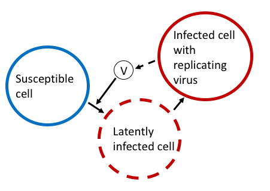
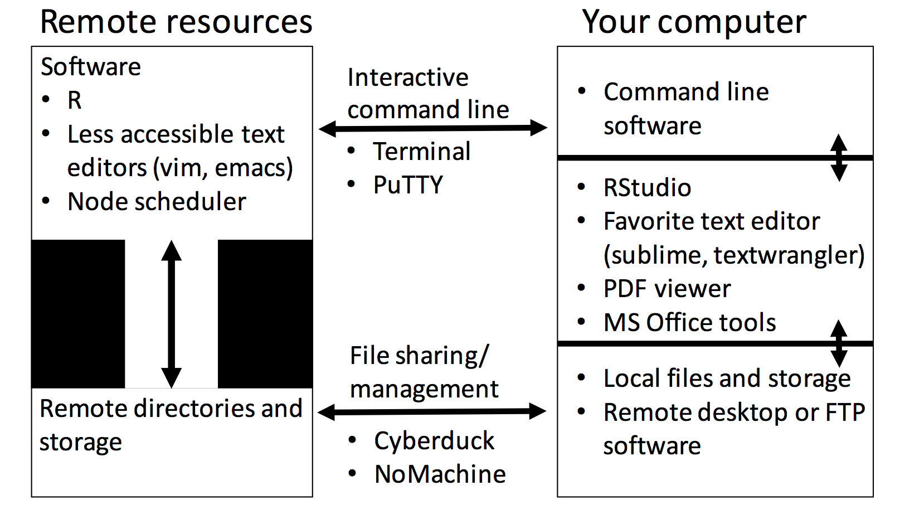
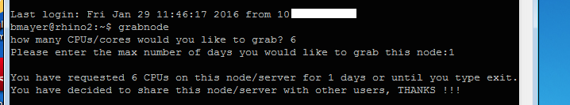
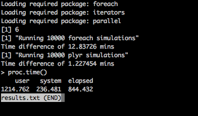
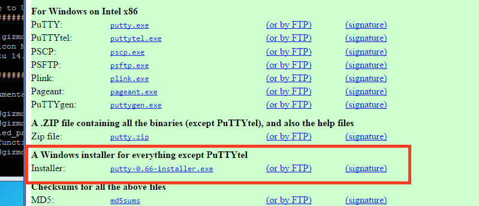
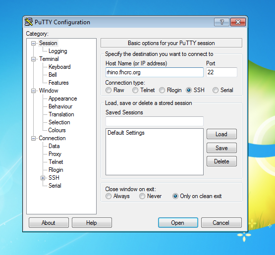
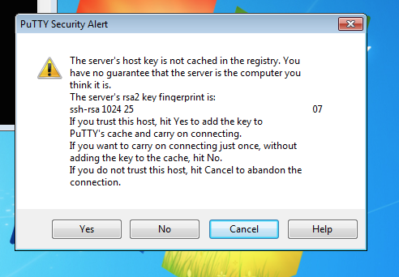
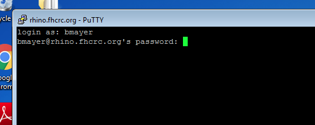
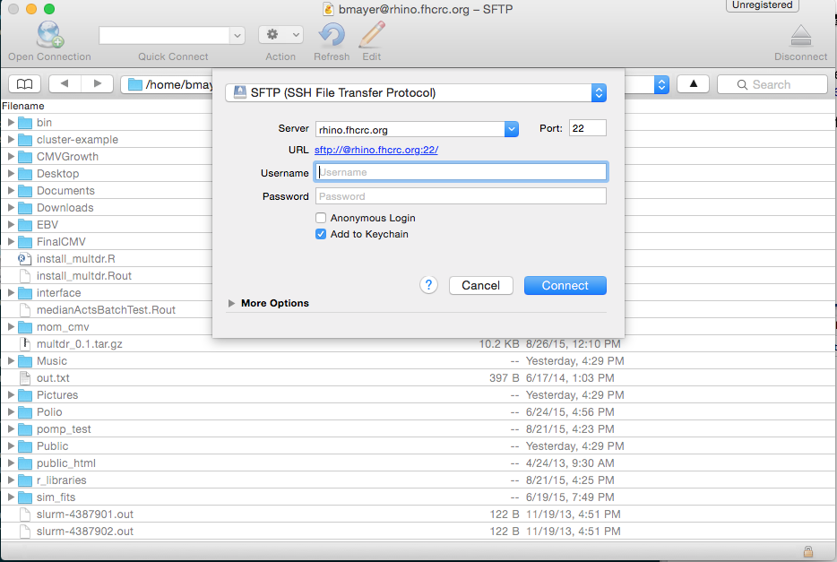
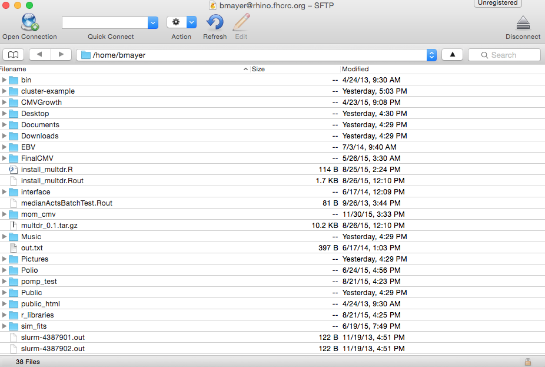

<link rel="stylesheet" href="http://yandex.st/highlightjs/7.3/styles/default.min.css">
<script src="http://ajax.googleapis.com/ajax/libs/jquery/1.9.0/jquery.min.js"></script>
<script src="http://yandex.st/highlightjs/7.3/highlight.min.js"></script>
<script>
$(document).ready(function() {
  $('pre code').each(function(i, e) {hljs.highlightBlock(e)});
});
</script>
<style>
pre code.bash {
  background: black;
  color: white;
  font-size: 1em;

}
</style>

Examples of parallel computing and using the cluster
========================================================
width: 1440
height: 900
transition: none
font-family: 'Helvetica'
css: my_style.css
title: "Examples of parallel computing and using the cluster"
author: Bryan Mayer
date: 2/4/2016


Topics
========================================================
1. Example background: a simulation study in CMV
2. Local machine parallel computing
3. Working on the remote machine
4. Sending jobs to the cluster

[All materials and code available on my fhcrc github](https://github.com/mayerbry/cluster-presentation/)


Simulation stochastic model
========================================================
type: sub-section


When a virus infects a cell, there are two outcomes: 1) many cells become infected and the infection is sustained (what we observe) or 2) only a few cells become infected and the infection is transient (not generally detected) - stochastic extinction. 

Two parameters strongly govern this probability:    
1. Cell infectivity at initial exposure - if one cell is infected, how many cells will it infect during its lifetime?    
2. How many cells are initially infected from an initial exposure?


 


Model code
========================================================

```r
library(knitr)
library(ggplot2) 
theme_set(theme_classic())

source("Code/model_functions.R") #model functions in here
```

[model function code](https://github.fhcrc.org/bmayer/cluster-presentation/blob/master/Code/model_functions.R) 

Example of a simulation:
========================================================
type: sub-section


```r
start_time = Sys.time()
example = stochastic_model_latent(max_time = 100, initI = 10, infectivity = 1.5, parms)
print(Sys.time() - start_time)
```

```
Time difference of 0.06643581 secs
```
The simulation function takes four arguments: 1) the total time to run it for (max_time); 2) initial infected cells (initI); 3) initial cell infectivity (infectivity); and 4) parms (this a data.frame that is created in model_function.R).

Example of a simulation:
========================================================
The output of interest is time and corresponding viral load at that time.


```r
ggplot(data = example, aes(x = time, y = viral_load)) + geom_line()
```


In this single simulation, the infection was sustained.

Multiple simulations example
========================================================


```r
total_simulations = 10

start_time = Sys.time()
example_simulations = NULL
for(run in 1:total_simulations){
  results = stochastic_model_latent(max_time = 100, initI = 10, infectivity = 1.1, parms)
  results$run = run #keep track of the run
  example_simulations = rbind(example_simulations, results)
}
print(Sys.time() - start_time)
```

```
Time difference of 0.897161 secs
```

```r
ggplot(data = example_simulations, 
       aes(x = time, y = viral_load, colour = factor(run))) + 
  geom_line()
```


In these 10 simulations, we observe several instances where the infection ends early.

Multiple simulations - how time scales with total simulations
========================================================

```r
total_simulations = 100

start_time = Sys.time()
example_simulations = NULL
for(run in 1:total_simulations){
  results = stochastic_model_latent(max_time = 100, initI = 10, infectivity = 1.1, parms)
  results$run = run #keep track of the run
  example_simulations = rbind(example_simulations, results)
}
print(Sys.time() - start_time)
```

```
Time difference of 8.494733 secs
```

```r
rm(example_simulations)
```
If this scaled linearly, we would've expected about 5 seconds but this approach gets worse and worse as the data.frame increases in size, 20x longer per 10x increase - A run of 1000 took 5 minutes, 600x longer for a 100x increase.

Note: Looping and stacking is inefficient in R.

Multiple simulations - planning ahead
========================================================
The actual simulation requirements

```r
total_simulations = 1000
I0s = c(1:10, 15, 10 * 2:9, 1:4 * 10^2)
infectivity_set = seq(1, 2, 0.05)

est_time = 5 * length(I0s) * length(infectivity_set)/24
cat(paste(est_time, "days"))
```

```
100.625 days
```

In this example, 1000 simulations per each combination of parameter settings. Actually did 10,000 each overnight.

Local machine parallelization
========================================================
type: section

1. The `doParallel` package    
2.  Using `foreach` (from doParallel)
3. The `plyr` package (uses doParallel)

the doParallel package
========================================================
type:sub-section
id:parallel_setup

https://cran.r-project.org/web/packages/doParallel/vignettes/gettingstartedParallel.pdf

```r
library(doParallel)
```
How many cores do I have?

```r
detectCores()
```

```
[1] 8
```
How many is R using (1 is default)?

```r
getDoParWorkers()
```

```
[1] 1
```

Registering cores in R
========================================================
Register your cores and check:

```r
registerDoParallel(2)
getDoParWorkers()
```

```
[1] 2
```

Using foreach
========================================================
type: sub-section
id: foreach_sim

The `foreach` call is very similar to writing a loop. In `foreach`, there are two arguments. First, you define what you are loop over (here we name that sequence 'run'). Then we set how the results are combined (`.combine = rbind`, which stacks rows with rbind). Then you call `%dopar% {}` with the task inside of the brackets. If parallelization is not necessary, you can use `%do%`.


```r
total_simulations = 1000

start_time = Sys.time()
example_simulations =  foreach(run = 1:total_simulations, .combine=rbind) %dopar% {
  results = stochastic_model_latent(max_time = 100, initI = 10, infectivity = 1.1, parms,
                                    seed_set = 5)
  results$run = run #keep track of the run
  results
}
print(Sys.time() - start_time)
```

```
Time difference of 1.351299 mins
```


```echo
rm(example_simulations)
```
Versus 5 minutes, so pretty good improvement.


The plyr package
========================================================
type:sub-section

The `plyr` package contains a set of functions that stacks R objects more efficiently. The functions follow the `apply` method of programming (which is just looping).

```r
?apply
```
- We will focus on `ldply`, a function that carries out a loop and lets us stack data frames
- In the following example, `ldply` takes two arguments: 1) a set of values to loop through (1:5) and a function that takes the values as a parameter (`i` here). The function just returns the input and `ldply` will stack those and return a data.frame .

```r
plyr::ldply(1:5, function(i) i)
```

```
  V1
1  1
2  2
3  3
4  4
5  5
```


[A biostatistics example](#/bio_plyr)    

Simulation example - using plyr
========================================================
id:plyr_example


```r
total_simulations = 1000

start_time = Sys.time()
example_simulations = plyr::ldply(1:total_simulations, function(run){ #ldply is a loop
  results = stochastic_model_latent(max_time = 100, initI = 10, infectivity = 1.1, parms,
                                    seed_set = 5)
  results$run = run #keep track of the run
  results
})
print(Sys.time() - start_time)
```

```
Time difference of 1.446029 mins
```

```r
rm(example_simulations)
```
This did even better than foreach without any parallel processing!

Adding parallel computing in plyr is simple.
========================================================
id: plyr_sim


```r
total_simulations = 1000

start_time = Sys.time()
example_simulations = plyr::ldply(1:total_simulations, function(run){ #ldply is like a loop
  results = stochastic_model_latent(max_time = 100, initI = 10, infectivity = 1.1, parms,
                                    seed_set = 5)
  results$run = run #keep track of the run
  results
}, .parallel = T) #Just set this .parallel = T after you close the function

print(Sys.time() - start_time)
```

```
Time difference of 58.13546 secs
```

```r
rm(example_simulations)
```
About 2x improvement.

Note: to use `.parallel = T`, [doParallel package needs to be loaded and cores need to be registered](#/parellel_setup)    


plyr vs. foreach (an opinion)
========================================================
type: sub-section

- Generally, if the resulting output is very big (in this example, > 1 million rows) then the computing solution needs to efficiently handle the data. In this case, `ldply` seems to be a superior solution to `foreach` using `.combine = rbind`. However, I did not search for better stacking methods for `foreach` and even `ldply` can become limited at this data size. 

- If the method is slow (e.g., MCMC computations) but the resulting output isn't very big, then this `foreach` implementation should be comparable.

- Large data manipulations: `data.table` and `dplyr` have implementations to make this more efficient.

Using the server
========================================================
type:section

I use the rhino servers through scicomp. It requires an account and a "fred" drive.
https://teams.fhcrc.org/sites/citwiki/SciComp/Pages/How%20to%20get%20or%20use%20an%20account.aspx

I will be doing tasks using Bash in the command line (Terminal app on a mac). For windows, you can use PuTTY (it is free):    
http://sharedresources.fredhutch.org/libresources/putty    
[Installing and using PuTTY](#/rhino_demo)    

Any blocked code with black background is command line (bash) code.    
Any blocked code with white background is R code.


Connecting to rhino - through the command line
========================================================


```bash
ssh bmayer@rhino.fhcrc.org
```
and then enter your password when prompted

Then this might happen (enter yes)


[Installing and using PuTTY](#/rhino_demo)    

Setting up the remote environment
========================================================
type:sub-section
id:remote_directory

Create directories to work from

```bash
mkdir cluster-example
mkdir installed_packages
```

Make this directory to remotely install R packages (next slide)

```bash
mkdir cluster-example
cd cluster-example
mkdir installed_packages
```

Open R

```bash
R
```

To quit R:

```r
quit()
```


How to check if a package is available.
========================================================
Check its version: will throw an error if the package is not available.

```r
packageVersion("data.table")
```
data.table is not installed, so let's install it.

```r
install.packages("data.table", lib = "installed_packages/") 
library(data.table, lib.loc = "installed_packages/")
packageVersion("data.table")
```

Note: When you load R on the server, it will always set your working directory to where you called R from. So all paths are relative to that. Get the absolute path with `getwd()`.


Transferring R scripts and files from local machine to the remote machine
========================================================
Four options:    
1. Use the command line (from the local computer transferring to the server in the correct directory). This can be a pain and will require a password if you don't set some advanced settings.

```bash
scp model_functions.R bmayer@rhino.fhcrc.org:/home/bmayer/cluster-example/
```

2. Use an ftp client (there are a few free ones for windows).    
https://cyberduck.io/?l=en    
[Using Cyberduck](#/cyberduck_demo)    


3. Use remote desktop software. For example, NoMachine remotely connects to a linux machine with graphical interface.
https://teams.fhcrc.org/sites/citwiki/SciComp/Pages/Connecting%20to%20Session%20Server%20from%20Mac.aspx

4. Do your programming from the shell using a text editor like vim or emacs (very high learning curve) combined with 1. to transfer figure and data files.

Using R on the server
========================================================
type:sub-section
id:r_server

When using R through the command line, a lot of convienent functionality is lost. For example, it is no longer easy to highlight and run chunks of code. However, using R on the server frees up your local machine for other tasks if you are conducting computational intensive processses (like using all of your cores for parallel processing).    

One option to continue using the interactive console, is to utilize the `source` function to read in scripts that you can edit outside of R then pass onto your remote drive using software like Cyberduck.

Remote workflows
========================================================
id: workflow

Interaction between your computer and the remote workspace.    
    


Note: git is also available on the server.


Running R scripts on the server
========================================================
The general code to run an R script on the server:

```bash
R CMD BATCH myR_script.R
```

This will create a myR.script.Rout (default naming) which contains an echo of all the code, results that were printed, and a process time statement at the end. You can check the file from the command line with:

```bash
less myR_script.Rout
```


To suppress the code echo and only output printed results add the `--slave` option. We also can add a second file name (results.txt) to name the output file.

```bash
R CMD BATCH --slave myR_script.R results.txt
```

Parallelization on the server
========================================================
type:section

1. In a session while logged on
2. Sending batch jobs

Grabbing nodes
========================================================
type: sub-section

While logged on you can request a set of cores to be used for computational requirements.

https://teams.fhcrc.org/sites/citwiki/SciComp/Pages/Grab%20Commands.aspx


|bash command    |total cores                                 |
|:---------------|:-------------------------------------------|
|grabfullnode    |12 processors on one node                   |
|grabnode        |6 processors on one node                    |
|grabhalfnode    |6 processors on one node (same as grabnode) |
|grabquarternode |3 processors one one node                   |
|grabcpu         |1 processor                                 |
|grabR           |1 processor (starts an R shell)             |
|grablargenode   |32 processors on a large-memory node        |

These commands don't actually grant you access (you already have access to cores) but they tell the server what your intentions are. Your session will then be moved to a node with available resources.  The link contains information on server etiquette: do not request more cores in your R session than you grabbed.

Grabbing nodes (grabnode command)
========================================================

In this example, we use grabnode and the request 6 cores for duration of 1 total day.


```bash
grabnode    
```
     

You may have to accept key changes like when you first logged on to the server.


Running the simulation script
========================================================
[foreach example](#/foreach_sim)    
[plyr example](#/plyr_sim)

Add the following to scripts to the server directory (for me "/users/bmayer/cluster-example/" from earlier):    
[model function code](https://github.fhcrc.org/bmayer/cluster-presentation/blob/master/Code/model_functions.R)    
[a script to run simulations](https://github.fhcrc.org/bmayer/cluster-presentation/blob/master/Code/test_server_code.R)


```bash
R CMD BATCH --slave test_server_code.R results.txt
less results.txt
```

Performance of simulation script
========================================================


```bash
less results.txt
```
    
plyr performance is far superior and it scaled closely to the estimates from the earlier simulations. 

Note that the results were only performance checks and that nothing from the model simulations was saved to be used. Alternatively, this script could've been run within R with `source("test_server_code.R")` and then example_simulations would be available for analysis in the console (after a 15 minute wait).

Sending a batch job using slurm
========================================================
type: sub-section

Another option is to send your job to the server where it will be assigned to a node. One advantage of this process is that you don't have to remain logged on to the server while your job completes. One disadvantage is that there is no interactive element.

https://teams.fhcrc.org/sites/citwiki/SciComp/Pages/R%20Howto%20for%20Gizmo.aspx

There are a lot of options and commands that will not be covered here. There are training sessions offered through the Hutch.    
http://centernet.fhcrc.org/CN/depts/hr/training/courses/Introduction_to_Gizmo.html

Batch job using slurm - R script
========================================================
[An R script for batch simulations](https://github.fhcrc.org/bmayer/cluster-presentation/blob/master/Code/test_batch_code.R)

Key differences from test_server_code.R:    
1. Removed the `foreach` method because it was too slow.    
2. In addition to 10000 simulations, 2 different parameter values to cycle through (nested ldply).    
3. Instead of saving all of the raw output (millions of rows), aggregated the results so one outcome per simulation per parameter setting. The goal is to count all of the simulations that had stochastic extinction (denoted T or F for each run).

Took 1.2 minutes last time, with 2x more simulations, expect about 2ish minutes now.

Batch job using slurm - command line
========================================================

```bash
sbatch --cpus-per-task=6 --time=0-2 --wrap="R --no-save --no-restore < test_batch_code.R"
```

Important options here:    
1) We request a node with at least 6 cores for use using cpus-per-task=6    
2) We estimate the time we require (days-hours) with time=0-2    
3) There are other available options not set here (e.g., email yourself updates when the job finishes)   
4) Leave R options (no-save and no-restore) within the -wrap

Check on your jobs (with your hutchID):    

```bash
squeue -u bmayer
```

Sometimes the job will be queued for awhile. The wait time depends on the cores and the time requested. Waiting time seems to increase over the week (Monday morning shortest, Friday afternoon longest). You can cancel your jobs using scancel followed by the JOBID number (found using squeue).


```bash
scancel 0000000x
```

Batch job using slurm
========================================================
An output file is created for each batch job (it will look like slurm-JOBID#.out, unless designated otherwise). The output file is updated as the job runs so you can see what code is currently being executed. If the job terminated early because of a bug, that will be the last line written to the .out file. You can inspect this code using `less`.    


```bash
less slurm-0000000x.out
```

After the job is finished, can quickly preview results:

```bash
less batch_results.csv
```


I might then transfer batch.results.csv to my computer for analyzing and graphing.

Additional parallelization options
========================================================
type:sub-section

Each job is sent to a node where the cores are accessed for your program. By sending multiple jobs, you have access to a lot of nodes (>100 jobs running). Taking advantage of this can be very powerful:
- Simplest method: Just send multiple jobs to the server (rerun the script and make sure you vary the output file names in the R code).
- Write more complicated bash scripts that use loops: have the loop pass in values to R that can be used for different simulation settings.

Bash loops (shell files)
========================================================
A bash loop can just repeatedly send jobs to the server but it can also pass values into R.

```bash
#!/bin/bash

for x in {1,2}; do
sbatch --cpus-per-task=6 --time=0-1 --wrap="R --no-save --no-restore '--args inf_set=$x' < test_loopbatch_code.R"
done
```

The '--args inf_set=$x' (single quotes required) defines the arguments to be passed (will be called inf_set in R). The $x grabs the values from x given in the loop command. Bash can be finicky; for example, don't add spaces between values in the loop.    

This code isn't for copying and pasting. Need to use a bash script file (.sh).    
[bash script for loop](https://github.fhcrc.org/bmayer/cluster-presentation/blob/master/Code/example_bash_loop.sh)

Bash loops - passing values into R
========================================================

The following R code must be in the R script (I put it at the top):

```r
args<-(commandArgs(TRUE));
if(length(args)==0){
  print("No arguments supplied.")

}else{
  for(i in 1:length(args)){
    eval(parse(text=args[[i]]))
  }
  print(args)
}
```
This tells R to check if there were values passed in. The variable name will come from the bash script. You can use that input to select certain parameter ranges or change output file names:


```r
#use the inputted values from the bash loop to reduce out subset (change output name)
if(inf_set == 1) infectivity_list = infectivity_list[1]
if(inf_set == 2) infectivity_list = infectivity_list[2]
out_file_name = paste("batch_results/batch_results_loop", inf_set, ".csv", sep = "") #output name varies by input; save in folder
```

For this example, a batch_results folder must be created in the remote directory. [The R script is available here.](https://github.fhcrc.org/bmayer/cluster-presentation/blob/master/Code/test_loopbatch_code.R)

Running the bash script
========================================================

```bash
./example_bash_loop.sh
```

If you get a weird permission error, may need to do the following:

```bash
chmod u+x example_bash_loop.sh
```

If the job seemingly completes but there is no output, check the .out file for errors. Is there a batch_results subdirectory created?

Output from multiple jobs
========================================================
__If you are running multiple jobs using the same script, make sure the output file names change or they will just be overwritten.__    

With multiple output files, it may be necessary to write a script to combine them.  Here is the script for this example.

```r
#remember this has to be in the cluster-example folder to access the relative path "batch_results/"
library(plyr)

output_file_names = list.files("batch_results/")

output = ldply(output_file_names, function(file_name){
  read.csv(paste("batch_results/", file_name, sep = ""), stringsAsFactors = F)
})

write.csv(output, "combined_batchloop_output.csv", row.names = F)
```
[R script to combine output](https://github.fhcrc.org/bmayer/cluster-presentation/blob/master/Code/combine_batch_output.R)


Summary using the remote servers
========================================================
type: sub-section

A big drawback of using the server/command line: no convenient interactive software like RStudio.
Tips:
- Identify the output you want from your runs (.Rda files, csv's, plots).    
- Find a workflow: find a comfortable way to quickly access your results and update code as needed (i.e., using NoMachine or Cyberduck to pass things back and forth) [Workflow diagram](#/workflow).    
- Anticipate bugs: don't let a 15 hour batch run go to waste because you wrote a write.csv command incorrectly at the end or forgot to vary output file names. Run an example batch first that should run quickly to check for bugs. Consider outputting results or printing status reports periodically.
- Parallelizing with nodes (looping batch scripts) means you may have to combine your output files.

The End
========================================================
type: section

(Extra slides follow)


Biostat example
========================================================
id:bio_plyr

Fake data set has randomly assigned measurements of IgG and IgA. Treatment measurements are an average 2 units higher.

```r
ptid = LETTERS[1:20]
immuno = c("IgG", "IgA")
trt = c("control", "treatment")
test_data = expand.grid(ptid = ptid, immuno = immuno, trt = trt)
test_data$outcome = with(test_data, ifelse(trt == "control", rnorm(40, 2), rnorm(40, 4)))
head(test_data)
```

```
  ptid immuno     trt   outcome
1    A    IgG control 4.0070454
2    B    IgG control 2.2545639
3    C    IgG control 1.9751333
4    D    IgG control 0.9752774
5    E    IgG control 1.8862961
6    F    IgG control 1.2913708
```

Biostat example
========================================================

Run a t-test for both immunoglobulins and save all the results together.

```r
ttest_results = plyr::ldply(immuno, function(imm){
  temp = with(subset(test_data, immuno == imm), t.test(outcome ~ trt))
  data.frame(
    immuno = imm,
    mean_diff = diff(temp$estimate),
    lower_ci = -temp$conf.int[2],
    upper_ci = -temp$conf.int[1]
  )
})
ttest_results
```

```
  immuno mean_diff lower_ci upper_ci
1    IgG  1.874648 1.324472 2.424825
2    IgA  1.948972 1.306380 2.591565
```

Biostat example
========================================================

```r
ggplot(data = ttest_results, 
       aes(x = immuno, y = mean_diff, ymin = lower_ci, ymax = upper_ci)) +
  geom_point() +
  geom_errorbar(width = 0.2)
```


[Go back to main talk (simulation example with plyr)](#/plyr_example)    


Connecting to rhino - using PuTTY (download)
========================================================
id: rhino_demo

Download PuTTY:    
http://www.chiark.greenend.org.uk/~sgtatham/putty/download.html    
The red box is what I downloaded.    


[Go back to main talk](#/remote_directory)    

Connecting to rhino - using PuTTY (connecting)
========================================================

Most of the settings are already set, just fill in the Host Name and click Open.    


Connecting to rhino - using PuTTY (connecting)
========================================================
 Then click yes.    
    
And then login.    


All of code in the black boxes is meant to be used in the command line and should work using PuTTY.

[Go back to main talk (creating remote directories)](#/remote_directory)    

Using Cyberduck
========================================================
id:cyberduck_demo

After Cyberduck is installed click on "Open Connection". Select "SFTP (SSH File Transfer Protocol)" from the dropdown. Enter the server name (rhino.fhcrc.org) , leave the port as 22, and then enter your hutchnet ID and password. Click connect.



Using Cyberduck
========================================================
This is what the interface looks like (on a Mac) after connected. You can drag and drop files and folders between your local machine and your server directory.



[Back to talk (R on server)](#/r_server)    


